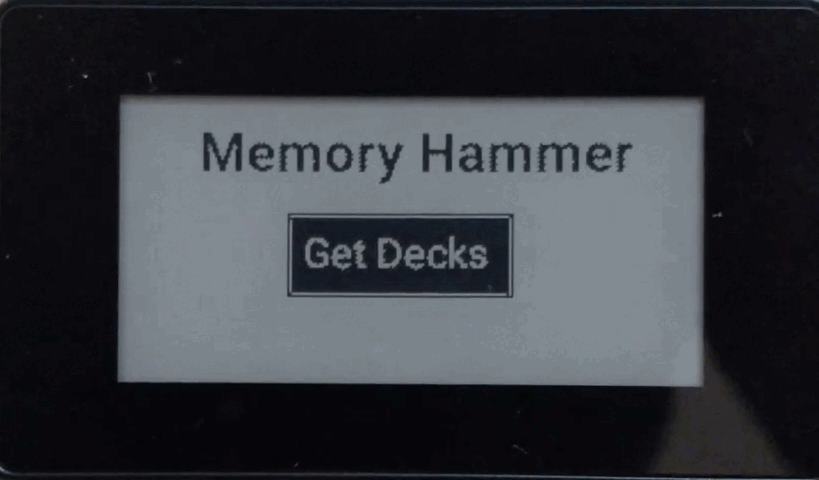

# Memory Hammer
An always-on Anki review system.

Click the above image for a video demo.

### Why
To solve Anki review accumulation by making the cards available for review when its due using always-on display system. By extension addressing [Human Memory, lack of thereof](https://needgap.com/problems/41-human-memory-lack-of-thereof-psychology-neuroscience).

### How
Using e-paper display attached to a raspberry pi and memory-hammer software.

### Features
1. Supports basic cards with plain text.
2. Review Anki Cards and set Ease Factor.
3. When a card is due, it's automatically displayed.

### Requirements
1. [Raspberry Pi Zero](https://www.raspberrypi.com/products/raspberry-pi-zero/).
2. [2.13inch Touch e-Paper HAT](https://www.waveshare.com/2.13inch-Touch-e-Paper-HAT-with-case.htm).
3. [Python 3.10](https://raw.githubusercontent.com/tvdsluijs/sh-python-installer/main/python.sh).
4. [Anki Desktop](https://apps.ankiweb.net/) with [Anki Connect](https://foosoft.net/projects/anki-connect/).

### Installation
1. Set up the [Raspberry Pi Zero with the e-paper hat](https://www.waveshare.com/wiki/2.13inch_Touch_e-Paper_HAT#Enable_SPI_interface) using Raspberry Pi OS(Headless is fine).
2. Install the latest version of [RPi.GPIO](https://sourceforge.net/p/raspberry-gpio-python/wiki/install/).
3. Set up Anki Connect on the desktop with **ANKICONNECT_BIND_ADDRESS**.
4. git clone https://github.com/abishekmuthian/memory-hammer.git
5. pip3.10 install -r requirements.txt

### Usage
1. Edit the **Config** section of the **memory_hammer.py** with the IP address of your Anki Desktop and port for Anki Connect.
2. python3.10 memory_hammer.py

#### Download the Decks using Get Decks

#### Select the deck for review using arrow buttons

#### Front-side of the card is displayed, Select show answer to show the back-side

#### Back-side of the card is displayed, Select the Ease Factor

+ A: Again
+ H: Hard
+ G: Good
+ E: Easy

#### If there are no due-cards available, It will be automatically retrieved and displayed

#### Misc
+ If the display has ghosting effects, Refresh the screen using the refresh button on the left.
+ Select the Home button to navigate to the Home screen.

#### Short-term project goals
+ Improving the performance.
+ Improving the stability.
+ Adding more features through feedback.

#### Long-term project goals
+ Make the project more accessible to non-technically inclined Anki users.

*Achievement of those goals depends upon the support I receive from you.*

### Support
If you think Memory Hammer is useful for you, [Support](https://buy.stripe.com/9AQ4k68AEcd7cBWcNm) the continuous development of Memory Hammer.

#### License for Memory Hammer
Memory Hammer, An always on Anki-review system.

Copyright (C) 2022  Abishek Muthian (www.memoryhammer.com).

This program is free software: you can redistribute it and/or #modify
it under the terms of the GNU Affero General Public License as
published by the Free Software Foundation, either version 3 of the
License, or (at your option) any later version.

This program is distributed in the hope that it will be useful,
but WITHOUT ANY WARRANTY; without even the implied warranty of
MERCHANTABILITY or FITNESS FOR A PARTICULAR PURPOSE.  See the
GNU Affero General Public License for more details.

You should have received a copy of the GNU Affero General Public #License
along with this program.  If not, see <https://www.gnu.org/#licenses/>.

#### License for libraries included within Memory Hammer

Licenses for libraries used in Memory Hammer are included within those library files.